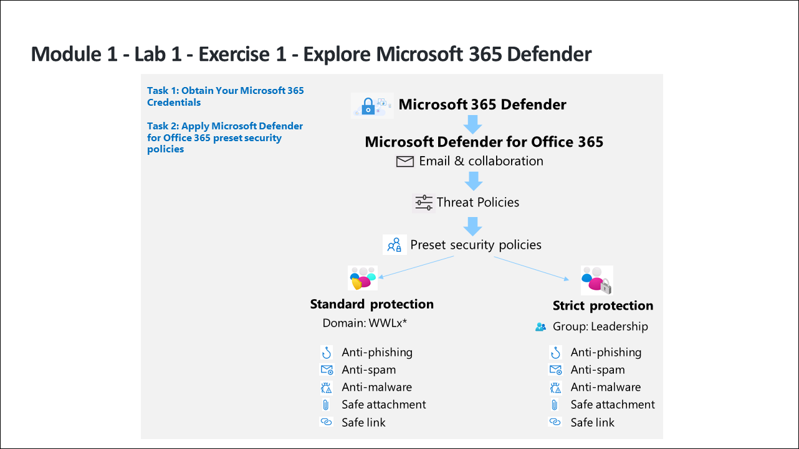
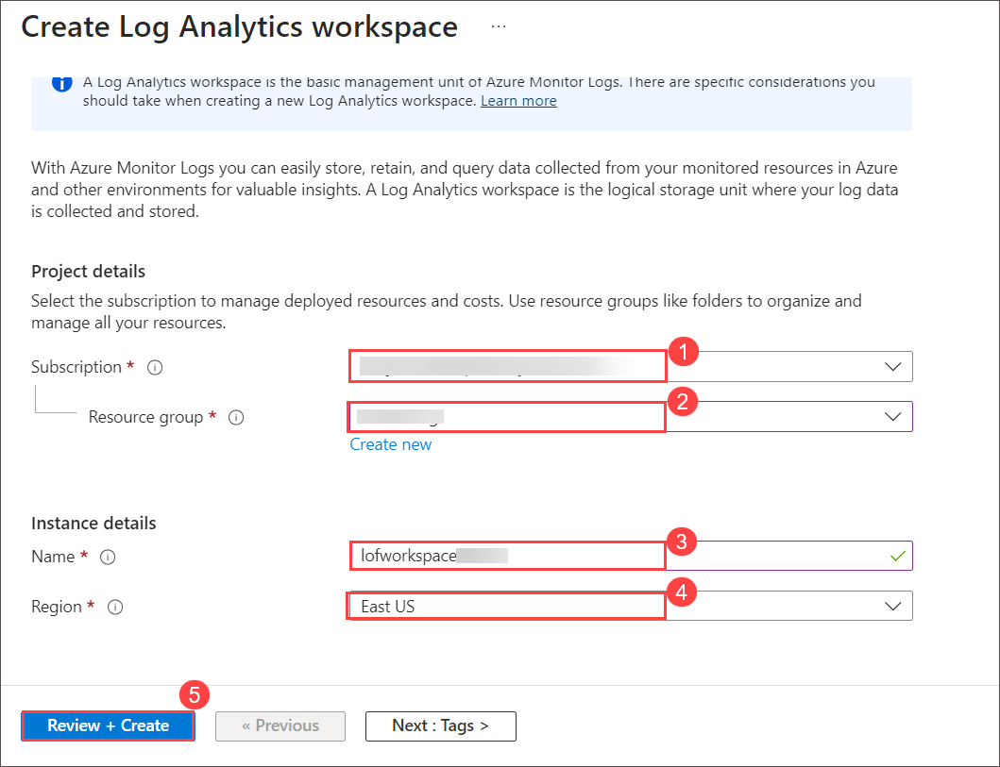
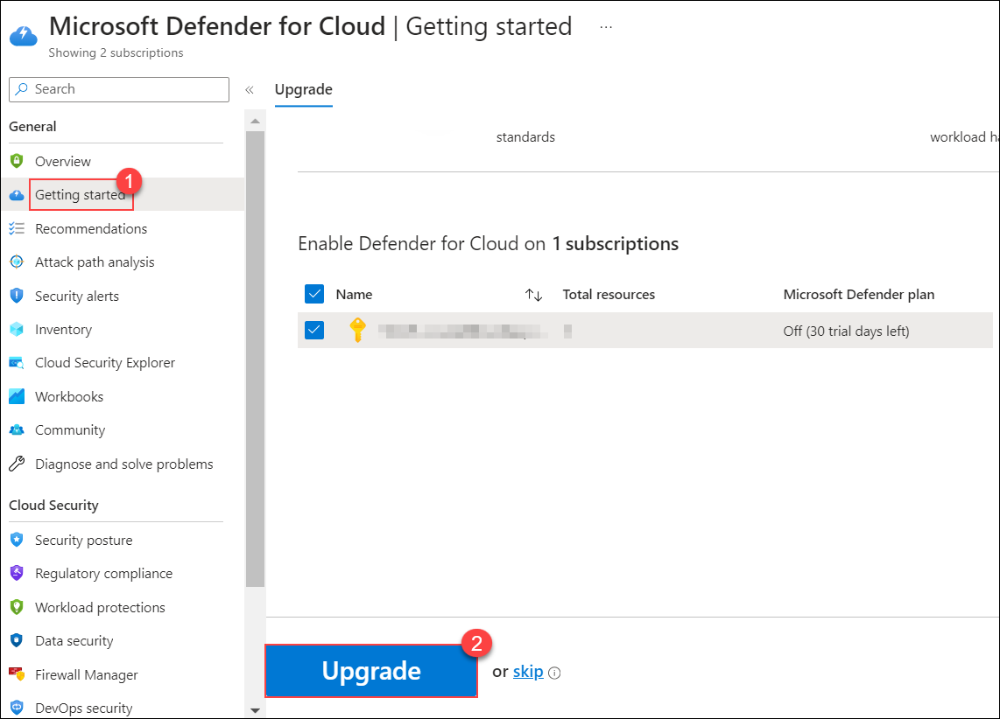
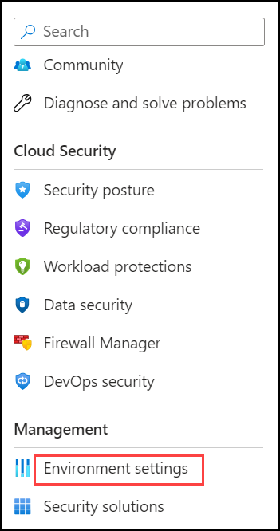
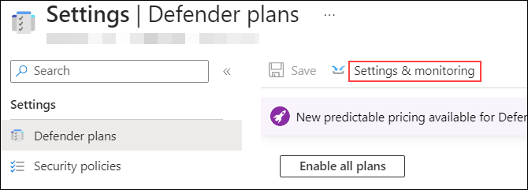

## Part:1 Lab 01 - Enable Microsoft Defender for Cloud

## Lab scenario
 You are a Security Operations Analyst working at a company that is implementing Microsoft 365 Defender. You start by assigning preset security policies in EOP and Microsoft Defender for Office 365.

## Lab objectives
In this lab, you will complete the following tasks:
- Task 1: Create a Group 
- Task 2: Apply Microsoft Defender for Office 365 preset security policies
- Task 3: Preparing the Microsoft 365 Defender workspace
    
## Estimated timing: 120 minutes

## Architecture Diagram

  

### Task 1: Create a Log Analytics Workspace

In this task, you will create a Log Analytics workspace for use with Microsoft Defender for Cloud.

1. In the Search bar of the Azure portal, type **Log Analytics**, then select **Log Analytics workspaces**.
   
   

1. Select **+ Create** from the command bar.
    
   

1. Select Resource Group from the drop down(sentinel-rg).

1. For the Name, enter something unique like **uniquenameDefender**.

1. Select the default Region 

1. Select **Review + Create**.

   

1. Once the workspace validation has passed, select **Create**. Wait for the new workspace to be provisioned, this may take a few minutes.

   

### Task 2: Enable Microsoft Defender for Cloud

In this task, you will enable and configure Microsoft Defender for Cloud.

1. In the Search bar of the Azure portal, type *Defender*, then select **Microsoft Defender for Cloud**.

   

1. Click the left menu and click on **Getting started**. On the **Getting Started** page, under the **Upgrade** tab, make sure your subscription is selected and then select the **Upgrade** button at the bottom of the page. Wait for the *Trial started* notification to appear, it takes about 2 minutes. **Hint:** You can click the bell button on the top bar to review your Azure portal notifications.

    

1. In the left menu for Microsoft Defender for Cloud, under Management, select **Environment settings**.

   
   
1. Select the subscription (or equivalent name in your Language). 

    .png)

1. Review the Azure resources that are now protected with the Defender for Cloud plans.

1. Select the **Settings & monitoring** tab from the Settings area (next to Save).

   

1. Review the monitoring extensions. Confirm that **Log Analytics agent/Azure Monitor agent** is **Off**. Close the Settings & monitoring page by selecting the 'X' on the upper right of the page.
   > **Note:** If **Log Analytics agent/Azure 
 Monitor agent** is **On** then change to **Off**. Press continoue on the top of right side.

   
    
1. To go back to the **Environment settings** and select the '>' to the left of your subscription.

1. Select the Log Analytics workspace you created earlier *uniquenameDefender* to review the available options and pricing.

1. Select **Enable all plans** for  services (**servers**) which you want to onboard (to the right of Select Defender plan) and then select **Save**. Wait for the *"Microsoft Defender plan for workspace uniquenameDefender was saved successfully!"* notification to appear.

   

   >**Note:** If the page is not being displayed, refresh your Edge browser and try again and if Plans are already enable no need to change anything.

1. Close the Defender plans page by selecting the 'X' on the upper right of the page to go back to the **Environment settings**

## Review
In this lab, you will complete the following tasks:
- Create a Group 
- Apply Microsoft Defender for Office 365 preset security policies
- Preparing the Microsoft 365 Defender workspace
