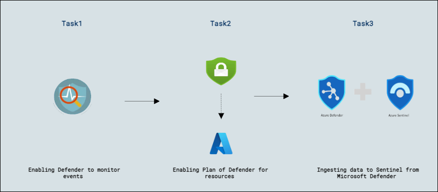
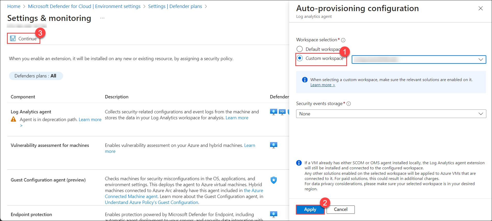

## Lab 04 - Ingest Logs from Microsoft Defender for Cloud

## Lab scenario
The Microsoft 365 Defender portal helps security teams investigate attacks across cloud resources, devices, and identities. In this lab, you will set up Log Analytics workspace in Azure and configure Microsoft Defender for Cloud to ingest security logs into the workspace for monitoring and analysis.

## Lab objectives (Duration: 45 minutes)
In this lab, you will complete the following tasks:
- Task 1: Enabling Defender to monitor events
- Task 2: Enabling Plan of Defender for resources
- Task 3: Ingesting data to Sentinel from Microsoft Defender

## Architecture Diagram
  
  
### Task 1: Enabling Defender to monitor events

In this task, you will explore ingesting logs from Microsoft Defender for Cloud.

1. On Azure Portal page, in **Search resources, services and docs (G+/)** box at the top of the portal, enter **Microsoft Defender for Cloud**, and then select **Microsoft Defender for Cloud** under services.

1. From **Microsoft Defender for Cloud | Overview** blade, under **Management** section select **Environment settings** and click on the **subscription**.

     

1. Click on **Defender Plans** on left blade, then click on **Settings&Monitoring** inbetween the page at top left.

    

1. Enable the **Log Analytics agent** which will Collects security-related configurations and event logs from the machine and stores the data in your Log Analytics workspace for analysis.

     >**Note**: If its already enabled, Please leave it to default and contine with the next step.

   

1. When **Auto-provisioning configuration** window opens, select **Custom Workspace** then select your workspace **sentinelworkspace**, click on **Apply** then **Continue**.

   

1. Back **Settings | Defender plans** and click on **Save**.
   
### Task 2: Enabling Plan of Defender for resources

In this task, you will enable the plan for resources on which diagnostics you want to be setup.

1. Enable Microsoft Defender for Cloud on the workspace on which you're installing the Log Analytics agent:

1. From **Microsoft Defender for Cloud | Overview** blade, under **Management** section select **Environment settings**.

1. Expand **Subscription** and select the workspace **sentinelworkspace**.

    

1. Set the workspace on which you're installing the agent. Make sure the workspace is in the same subscription you use in Defender for Cloud and that you have read/write permissions for the workspace.

1. Select one or both **Servers** or **SQL servers on machines** and set to **on** (Foundational CSPM is the free default), and then select **Save**.

   

### Task 3: Ingesting data to Sentinel from Microsoft Defender

1. For Microsoft Defender data to ingest to Sentinel you need to use the connectors provided by the Sentinel.
1. In the search bar, search and select Microsoft Sentinel, select **sentinelworkspace**.

   

1. Select the conenctor of **Microsoft Defender for Cloud** and click on install to get the logs into the Sentinel.
   
    

### Conclusion
Upon completion, the organization achieves an elevated security posture with enhanced monitoring, threat detection, and efficient data analysis. The integration of Defender for Cloud and Sentinel aligns with the goal of maintaining a secure Azure environment.

### Review
In this lab, you will complete the following tasks:
- Enabling Defender to monitor events
- Enabling Plan of Defender for resources
- Ingesting data to Sentinel from Microsoft Defender
