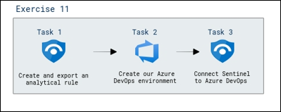
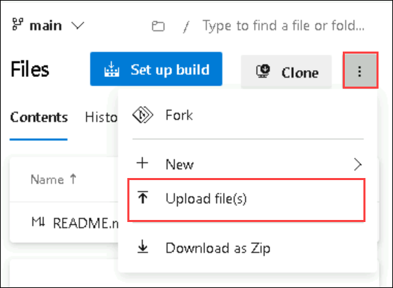

# Part:1 Lab 04 - Use Repositories in Microsoft Sentinel

## Lab scenario

You are a Security Operations Analyst working at a company that implemented Microsoft Sentinel. You already created Scheduled and Microsoft Security Analytics rules.  You need to centralize analytical rules in an Azure DevOps repository.  Then connect Sentinel to the Azure DevOps repository and import the content. 

>**Note:** An **[interactive lab simulation](https://mslabs.cloudguides.com/guides/SC-200%20Lab%20Simulation%20-%20Use%20repositories%20in%20Microsoft%20Sentinel)** is available that allows you to click through this lab at your own pace. You may find slight differences between the interactive simulation and the hosted lab, but the core concepts and ideas being demonstrated are the same.

## Lab objectives
 In this lab, you will Understand following:
 - Task 1: Create and export an analytical rule
 - Task 2: Create our Azure DevOps environment
 - Task 3: Connect Sentinel to Azure DevOps.

## Estimated timing: 30 minutes

## Architecture Diagram

   

### Task 1: Create and export an analytical rule

In this task, you will enable Entity behavior analytics in Microsoft Sentinel.

1. In the Search bar of the Azure portal, type *Sentinel*, then select **Microsoft Sentinel**.

1. Select your Microsoft Sentinel Workspace.

1. Select **Analytics** under the *Configuration* area from the left blade.

1. Select the **Startup RegKey** rule that you created earlier.

1. Select the **Export** from the toolbar. **Hint:** You might need to select the ellipsis icon **(...)** to see it.

   

1. The rule is exported to a text file named *Azure_Sentinel_analytic_rule.json*.

1. Select **Open file** below the name of the downloaded file and then select **More apps**.

1. Select **Notepad** and then select **OK**.

1. Review the Azure Resource Manager template and the close it when done.

### Task 2: Create our Azure DevOps environment

In this task, you will create an Azure DevOps repository.

1. Open another tab in the browser and navigate to (https://aexprodcus1.vsaex.visualstudio.com/me?mkt=en-US).

1. On the *We need a few more details* page, select **Continue**.

1. On the *Get started with Azure DevOps* page, select **Create new organization** and then select **Continue**.

1. On the *Almost done...* page, enter a name for your DevOps organization that you would not want to use in the future, like for example, your tenant prefix. **Hint:** It can be found in the Resources tab of your lab (WWLx...).

1. *Enter characters you see*, then **Continue**.

1. On the *Create a project to get started* page, enter **My Sentinel Content** and then select **Create project**.

1. Navigate to **Repos** on the left pane.

1. At the bottom of the page in the area *Initialize main branch with a README or gitignore*, select **Initialize**.

     

1. The page should show the Files for the Repo.  the only file is README.me.

1. On the Files (right side of the page) blade, the toolbar includes options *Set up build*, *Clone*, ... Select the colon icon **(:)** to show more options.

1. Select **Upload Files**.

    

1. Select **Browse** and select the file **Azure_Sentinel_analytic_rule.json** from your *Downloads* directory.

1. Select **Commit**.

1. Select **Azure DevOps** on the top left corner of the page.  This displays your organization and projects.

1. Select **Organization settings** from the bottom left of the page.

1. Select **Policies** under the *Security* area of the left blade.

1. Toggle **On** *Third-party application access via OAuth* under the *Application connection policies* area.

   

### Task 3: Connect Sentinel to Azure DevOps.

1. Select the *Azure Portal*/*Microsoft Sentinel* tab in your browser.

1. In Microsoft Sentinel, select **Repositories (Preview)** in the *Content Management* section.

1. Select **+ Add new** button from the toolbar.

1. For the name enter **My Content**.

1. For Source control, select **Azure DevOps**.

1. Select **Authorize**. Scroll down the permissions request and then select **Accept**.

1. Select the Organization you created earlier (e.g., WWLx...).

1. Select the Project you created earlier, *My Sentinel Content*.

1. Select the Repository you created earlier, *My Sentinel Content*. **Hint:** You might need to scroll down within the drop-down to see the repository.

1. Select the Branch **main**. **Hint:** You might need to scroll down within the drop-down to see the branch.

1. Select all content types.

1. Then select **Create**.

1. Go back to Microsoft Sentinel workspace if needed

1. Go to the *Repositories (Preview)* page, select **Refresh**. Wait until the last deployment status* is *Failed*.  

    

    >**Note:** The *Failed* status is due to limitations in the hosted lab environment. You would normally see *Succeeded*. Then you can see in the *Analytics* the imported rule *Rule from Azure DevOps*.
