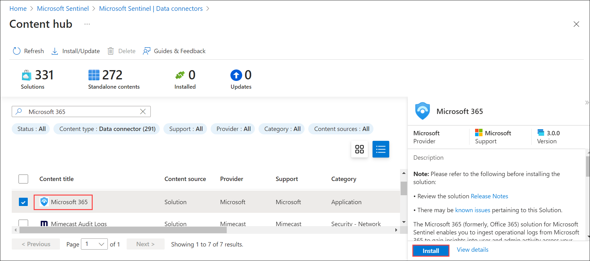

## Lab 09 - Ingest Logs from Microsoft 365

## Lab scenario

In this lab, you will set up log ingestion from Microsoft 365 into a SIEM (Security Information and Event Management) solution for security monitoring and analysis.

## Lab objectives (Duration: 45 minutes)
In this lab, you will complete the following tasks:
- Task 1: Ingesting logs from Microsoft Entra ID to Sentinel

## Architecture Diagram

   

### Task 1: Ingesting logs from Microsoft 365 to Sentinel 

In this task, you will explore the Microsoft Sentinel .

1. On Azure Portal page, in **Search resources, services and docs (G+/)** box at the top of the portal, enter **Microsoft Sentinel**, and then select **Microsoft Sentinel** under services.
     

1. Select **sentinelworkspace**.

1. Select the **Data Connectors** under **Configuration** and select **Go to content hub**.

       

1. Search for and select the **Microsoft 365** connector. Select the AD connector.

   

1. Click on **Install**.

1. Back on **Microsoft Sentinel | Data connectors** page and from left navigation pane select **Analytics** under **Configuration** section.
   
1. Now you need to setup a analytics rule to get alerts as a incident in the Sentinel, under **Rule templates** tab search for **Microsoft 365** and click on **Create rule**.
   
1. Click on **Automated response** then **Review + create** and click on **Save**. This will create an alert rule.
   
1. Now you will be able to see the incidents generated by the Microsoft 365 in **incidents** tab once you setup an alert rule.
   >**Note**: It will take 1 - 2 hours of time to generate **incidents** so kindly procced with next exercise.  

    

## Review
In this lab we have completed Ingesting logs from Microsoft 365 to Sentinel.
