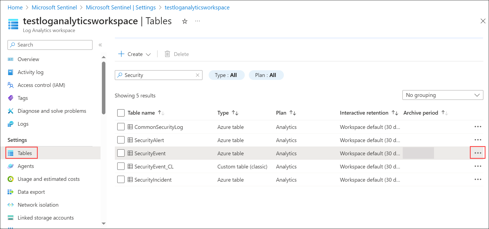

## Lab 12 - Configure Log Retention

## Lab Overview
Log retention refers to the practice of storing and maintaining logs or records of events, activities, and data for a specific period. In the context of cybersecurity and information technology, log retention is crucial for various reasons, including compliance with regulations, forensic analysis, troubleshooting, and overall security management. 

## Lab scenario
In this lab, you will configure log retention settings within Microsoft Sentinel to meet the company's requirements. The primary focus is on minimizing costs, ensuring compliance with regulations, and providing a manageable environment for the security team's daily responsibilities.

## Lab objectives (Duration: 10 minutes)

In this lab, you will complete the following tasks:
- Task 1: Configure Log Retention

### Task 1: Configure Log Retention

In this task, you will change the retention period for the SecurityEvent table. The specific steps involve navigating through Microsoft Sentinel and the Log Analytics workspace settings to locate the SecurityEvent table and adjust its retention period to 180 days. The objective is to strike a balance between compliance requirements and operational efficiency.

1. In Microsoft Sentinel, select the **Settings** option in the *Configuration* area.

1. Select **Workspace settings**.

      

1. In Log Analytics workspace, select the **Tables (preview)** option in the *Settings* area.

1. Search and select the table **SecurityEvent**, and then select the ellipsis button (...).

        

1. Select **Manage Table**.

1. Select **180 days** for *Total retention period*. Then **Save**.

## Review
In this lab, you have completed configuring retention logs in Microsoft Sentinel.
